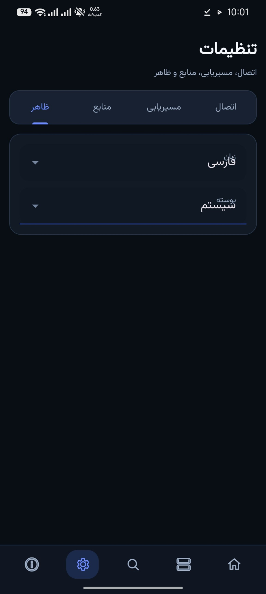
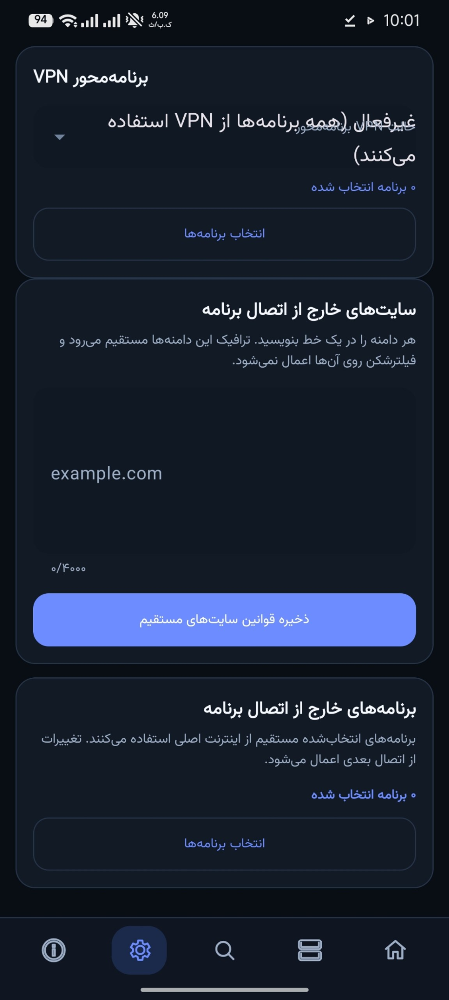

# dicodePing

یک کلاینت چندسکویی برای دریافت، ارزیابی و اتصال به کانفیگ‌های پروکسی با رابط فارسی و انگلیسی.

## وضعیت نسخه

**v1.9.0-rc.14** — اتصال واقعی Aether/WARP در Android با جریان فعال‌سازی تا Home، fallback خودکار و اعتبارسنجی ترافیک؛ به‌همراه اصلاحات رابط، اسکنر و GitHub Pages.

## سکوها

| سکو | اجرا/بسته‌بندی |
|---|---|
| Windows | Python source و خروجی PyInstaller |
| Linux | Python source و بسته tar.gz |
| macOS | Python source و DMG |
| Android | پروژه Gradle با flavor استاندارد و rooted |

## هسته‌های اتصال

| هسته | Desktop | Android | توضیح |
|---|---:|---:|---|
| Xray | ✅ | ✅ | هسته پیش‌فرض |
| Aether | ✅ | ✅ | در APK برای arm64-v8a و x86_64 قرار می‌گیرد |
| WARP / Usque | ✅ | ✅ | ثبت‌نام با پذیرش شرایط و اجرای SOCKS محلی |
| Psiphon | مشروط | مشروط | فقط با client.config مجاز توزیع |

## اجرای سورس دسکتاپ

```bash
python -m pip install -r requirements.txt
python app.py
```

## Android

```bash
cd dicodePing_android
./gradlew assembleStandardDebug
```

برای بیلد Release باید Xray AAR و باینری‌های امضاشده Aether/Usque طبق اسکریپت‌های `tools/` آماده شوند. اطلاعات کلید امضا نباید در مخزن قرار بگیرد.

در Android، پس از فعال‌کردن Aether یا WARP، کاربر به Home هدایت می‌شود و با دکمه اتصال همان هسته را اجرا می‌کند. مسیر اصلی و HTTP/2 fallback امتحان می‌شوند و برنامه فقط بعد از عبور ترافیک واقعی وضعیت متصل را ثبت می‌کند.

## اسکنر

اسکنر دو وضعیت مستقل نشان می‌دهد: **دریافت کانفیگ‌ها** و **آزمایش سرورها**. لاگ زنده تا ۲۴۰ خط آخر را نگه می‌دارد و رویدادهای خطا، مرحله، نتیجه و سرور پیدا‌شده را برجسته می‌کند.

## تصاویر Android

<p align="center">
  
  
</p>

## کیفیت و امنیت

```bash
python tools/verify_version.py
python -m compileall -q app.py dicodeping shared tools tests
python -m pytest -q
python tools/quality_gate.py
python dicodePing_android/tools/validate_project.py
```

- گزارش آسیب‌پذیری: [SECURITY.md](SECURITY.md)
- حریم خصوصی: [PRIVACY.md](PRIVACY.md)
- مجوزها و مؤلفه‌های ثالث: [THIRD_PARTY_NOTICES.md](THIRD_PARTY_NOTICES.md)

## انتشار

برای انتشار کامل RC14 در ویندوز، ZIP را Extract و فایل `DEPLOY_PRERELEASE_RC14.bat` را اجرا کنید. این اسکریپت سورس تمیز را روی `main` می‌فرستد، تگ `v1.9.0-rc.14` را ایجاد یا جایگزین می‌کند و تا انتشار خروجی‌های Windows، Linux، macOS و Android منتظر می‌ماند. راهنمای کوتاه در `DEPLOY_PRERELEASE_RC14_README_FA.txt` قرار دارد.

Workflowهای فعال فقط `ci.yml`، `codeql.yml`، `docs.yml` و `release.yml` هستند. انتشار RC14 با تگ `v1.9.0-rc.14` آغاز می‌شود.
